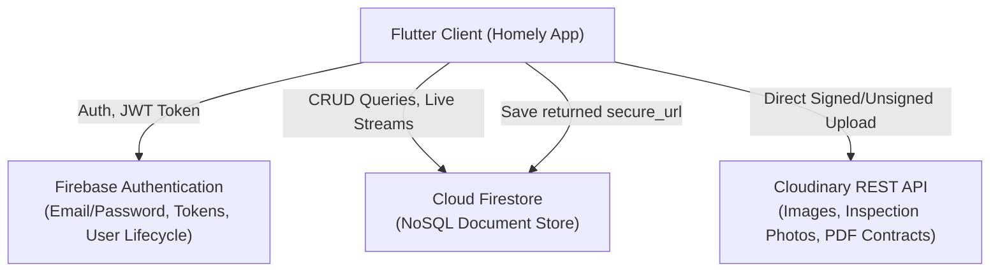

# HOMELY — Production Backend & Architecture Specification
**Target Backend:** Firebase (Auth & Cloud Firestore)  
**Target Media & Document Storage:** Cloudinary  
**Client Framework:** Flutter (Riverpod + GoRouter)  

---

## 1. System Architecture Overview



- **Authentication**: Firebase Authentication manages user accounts, password resets, tokens, and session persistence.
- **Primary Database**: Cloud Firestore stores all structured domain models, relationships, financial ledgers, maintenance tickets, and analytical metadata under user-isolated documents.
- **Media & File Storage**: Cloudinary stores property galleries, tenant verification docs, lease PDFs, receipts, and user avatars with automatic format/quality optimization (`f_auto,q_auto`).
- **Data Isolation**: Strict multi-tenant isolation where each user has access only to their own properties, tenants, leases, and financial data (`where('userId', '==', auth.uid)` or `/users/{uid}/...`).

---

## 2. Cloudinary Folder Structure & Upload Presets

Cloudinary handles all binary assets (images, receipts, PDFs).

### Folder Hierarchy
```
homely/
  ├── {userId}/
  │     ├── avatars/          (User profile photos)
  │     ├── properties/       (Property gallery images)
  │     ├── tenants/          (Tenant ID photos, documents)
  │     ├── leases/           (Signed lease contracts - PDF/images)
  │     ├── maintenance/      (Before/after maintenance photos)
  │     └── receipts/         (Expense bills, invoices, payment proofs)
```

### Upload Presets & Transformations
1. **Unsigned Upload Preset**: `homely_app_unsigned` (restricted to client app, or mediated via Firebase Cloud Function for signed uploads).
2. **Transformations**:
   - **Avatars**: `c_thumb,w_300,h_300,g_face,f_auto,q_auto`
   - **Property Photos**: `c_fill,w_1200,h_800,f_auto,q_auto`
   - **Thumbnails**: `c_fill,w_400,h_300,f_auto,q_auto`
   - **Receipts/Documents**: Raw or standard PDF delivery (`fl_attachment` or secure view).

---

## 3. Cloud Firestore Database Schema

### 3.1 `users` Collection
Path: `/users/{userId}`

```json
{
  "uid": "string (Firebase Auth UID)",
  "name": "string (e.g. John Malik)",
  "email": "string (e.g. john.malik@mail.com)",
  "phone": "string (optional, e.g. +92 300 1234567)",
  "city": "string (e.g. Lahore)",
  "avatarUrl": "string (Cloudinary secure_url)",
  "currency": "string (default: 'Rs')",
  "dateFormat": "string (default: 'd MMM y')",
  "theme": "string ('system' | 'light' | 'dark')",
  "notificationsEnabled": "boolean (default: true)",
  "createdAt": "timestamp",
  "updatedAt": "timestamp"
}
```

---

### 3.2 `properties` Collection
Path: `/properties/{propertyId}`

```json
{
  "id": "string (auto-generated ID)",
  "userId": "string (Owner UID)",
  "name": "string (e.g. Green Villa)",
  "type": "string ('apartment' | 'house' | 'commercial' | 'villa' | 'office')",
  "status": "string ('rented' | 'vacant' | 'maintenance' | 'listed')",
  "address": "string (e.g. 416 Oak Street, Sector J)",
  "area": "string (e.g. DHA Phase 6)",
  "city": "string (e.g. Lahore)",
  "country": "string (e.g. Pakistan)",
  "yearBuilt": "number (e.g. 2021)",
  "purchasePrice": "number (integer in base currency, e.g. 38000000)",
  "currentValue": "number (e.g. 48500000)",
  "monthlyExpenses": "number (estimated baseline expenses, e.g. 28000)",
  "unitCount": "number (total units in building, e.g. 1 or 4)",
  "bedrooms": "number? (optional, e.g. 5)",
  "bathrooms": "number? (optional, e.g. 4)",
  "areaSqft": "number? (e.g. 4500)",
  "photoUrls": "array<string> (Cloudinary URLs)",
  "coverPhoto": "string? (first photoUrl)",
  "amenities": "array<string> (e.g. ['Parking', 'Generator', 'Security', 'Pool'])",
  "notes": "string?",
  "valueHistory": [
    {
      "date": "timestamp",
      "value": "number"
    }
  ],
  "createdAt": "timestamp",
  "updatedAt": "timestamp"
}
```

---

### 3.3 `units` Collection (or Subcollection `/properties/{propertyId}/units/{unitId}`)
Path: `/units/{unitId}`

```json
{
  "id": "string",
  "propertyId": "string (foreign key -> properties)",
  "userId": "string (Owner UID)",
  "unitNumber": "string (e.g. 'Suite 804', 'Floor 3', 'Unit B')",
  "bedrooms": "number",
  "bathrooms": "number",
  "rentAmount": "number (monthly expected rent)",
  "depositAmount": "number",
  "occupied": "boolean (true if active lease exists)",
  "currentLeaseId": "string? (foreign key -> leases)",
  "currentTenantId": "string? (foreign key -> tenants)",
  "createdAt": "timestamp"
}
```

---

### 3.4 `tenants` Collection
Path: `/tenants/{tenantId}`

```json
{
  "id": "string",
  "userId": "string (Owner UID)",
  "name": "string (e.g. Hamza Tariq)",
  "email": "string",
  "phone": "string",
  "avatarUrl": "string? (Cloudinary secure_url)",
  "nationalId": "string? (CNIC/Passport number)",
  "emergencyContact": {
    "name": "string?",
    "phone": "string?",
    "relation": "string?"
  },
  "rating": "number (1.0 to 5.0)",
  "status": "string ('active' | 'past' | 'prospective')",
  "notes": "string?",
  "createdAt": "timestamp",
  "updatedAt": "timestamp"
}
```

---

### 3.5 `leases` Collection
Path: `/leases/{leaseId}`

```json
{
  "id": "string",
  "userId": "string (Owner UID)",
  "propertyId": "string (foreign key -> properties)",
  "unitId": "string? (optional foreign key -> units)",
  "tenantId": "string (foreign key -> tenants)",
  "startDate": "timestamp",
  "endDate": "timestamp",
  "rent": "number (e.g. 180000)",
  "deposit": "number (e.g. 360000)",
  "dueDay": "number (1-31, day of the month rent is due)",
  "paymentFrequency": "string ('monthly' | 'quarterly' | 'yearly')",
  "active": "boolean",
  "contractUrl": "string? (Cloudinary PDF/Image URL)",
  "terms": "string?",
  "createdAt": "timestamp",
  "updatedAt": "timestamp"
}
```

---

### 3.6 `ledger` Collection (Financial Incomes & Expenses)
Path: `/ledger/{entryId}`

```json
{
  "id": "string",
  "userId": "string (Owner UID)",
  "propertyId": "string (foreign key -> properties)",
  "unitId": "string? (optional foreign key -> units)",
  "leaseId": "string? (optional foreign key -> leases)",
  "tenantId": "string? (optional foreign key -> tenants)",
  "kind": "string ('income' | 'expense')",
  "category": "string ('maintenance' | 'utilities' | 'tax' | 'repairs' | 'insurance' | 'management' | 'renovation' | 'mortgage' | 'other')",
  "incomeType": "string? ('rent' | 'deposit' | 'parking' | 'utilities' | 'other')",
  "amount": "number (positive integer in PKR/local currency, e.g. 98000)",
  "date": "timestamp (transaction date)",
  "note": "string? (e.g. 'Air conditioner repair in master bed')",
  "method": "string ('cash' | 'bank' | 'card' | 'online')",
  "status": "string ('completed' | 'pending' | 'overdue')",
  "receiptUrl": "string? (Cloudinary bill/receipt photo)",
  "createdAt": "timestamp"
}
```

---

### 3.7 `maintenance` Collection
Path: `/maintenance/{ticketId}`

```json
{
  "id": "string",
  "userId": "string (Owner UID)",
  "propertyId": "string (foreign key -> properties)",
  "unitId": "string? (optional)",
  "tenantId": "string? (optional)",
  "title": "string (e.g. 'Pool pump service')",
  "category": "string ('appliance' | 'plumbing' | 'electrical' | 'hvac' | 'structural' | 'cleaning' | 'other')",
  "priority": "string ('low' | 'medium' | 'high' | 'urgent')",
  "status": "string ('open' | 'inProgress' | 'completed' | 'cancelled')",
  "scheduledFor": "timestamp?",
  "estimatedCost": "number",
  "actualCost": "number?",
  "photoUrls": "array<string> (Cloudinary before/after photos)",
  "notes": "string?",
  "assignedVendor": {
    "name": "string?",
    "phone": "string?"
  },
  "createdAt": "timestamp",
  "completedAt": "timestamp?"
}
```

---

### 3.8 `documents` Collection
Path: `/documents/{documentId}`

```json
{
  "id": "string",
  "userId": "string (Owner UID)",
  "propertyId": "string? (foreign key)",
  "leaseId": "string? (foreign key)",
  "title": "string (e.g. 'Property Tax Deed 2026')",
  "type": "string ('lease' | 'insurance' | 'deed' | 'invoice' | 'receipt' | 'other')",
  "fileUrl": "string (Cloudinary secure_url)",
  "fileSize": "number (in bytes)",
  "mimeType": "string (e.g. 'application/pdf', 'image/jpeg')",
  "expiresAt": "timestamp?",
  "createdAt": "timestamp"
}
```

---

### 3.9 `reminders` Collection
Path: `/reminders/{reminderId}`

```json
{
  "id": "string",
  "userId": "string",
  "propertyId": "string?",
  "title": "string (e.g. 'Collect rent from Tower B Unit 2')",
  "dueDate": "timestamp",
  "completed": "boolean",
  "category": "string ('rent' | 'lease' | 'maintenance' | 'inspection' | 'tax')",
  "priority": "string ('low' | 'medium' | 'high')",
  "createdAt": "timestamp"
}
```

---

## 4. Cloud Firestore Security Rules

Ensure multi-tenant isolation where users can only read and write their own documents:

```javascript
rules_version = '2';
service cloud.firestore {
  match /databases/{database}/documents {
    
    // Helper function to verify authentication
    function isAuthenticated() {
      return request.auth != null;
    }
    
    // Helper function to check document ownership
    function isOwner(userId) {
      return isAuthenticated() && request.auth.uid == userId;
    }

    // Users profile
    match /users/{userId} {
      allow read, write: if isOwner(userId);
    }

    // Collections partitioned by userId field
    match /{collection}/{docId} {
      allow read, write: if isAuthenticated() && (
        resource == null || resource.data.userId == request.auth.uid
      ) && (
        request.resource == null || request.resource.data.userId == request.auth.uid
      );
    }
  }
}
```

---

## 5. Cloudinary Client Integration Spec (Flutter)

### Dependency
Add to `pubspec.yaml`:
```yaml
dependencies:
  cloudinary_public: ^0.23.1 # or http multipart direct API
```

### Cloudinary Service Contract (`CloudinaryService`)
```dart
abstract interface class StorageService {
  Future<String> uploadImage({
    required File file,
    required String folder,
    String? customFileName,
  });

  Future<String> uploadDocument({
    required File file,
    required String folder,
  });

  Future<void> deleteFile(String publicId);
}
```

### Direct HTTP REST Upload Implementation
```dart
class CloudinaryStorageService implements StorageService {
  CloudinaryStorageService({
    required this.cloudName,
    required this.uploadPreset,
  });

  final String cloudName;
  final String uploadPreset;

  @override
  Future<String> uploadImage({
    required File file,
    required String folder,
    String? customFileName,
  }) async {
    final uri = Uri.parse('https://api.cloudinary.com/v1_1/$cloudName/image/upload');
    final request = http.MultipartRequest('POST', uri)
      ..fields['upload_preset'] = uploadPreset
      ..fields['folder'] = folder
      ..files.add(await http.MultipartFile.fromPath('file', file.path));

    final response = await request.send();
    final resBody = await response.stream.bytesToString();
    if (response.statusCode != 200) {
      throw Exception('Cloudinary upload failed: $resBody');
    }
    final json = jsonDecode(resBody);
    return json['secure_url'] as String;
  }
}
```

---

## 6. Flutter Repositories Architecture to Replace Current In-Memory Seeds

In the current codebase, repositories implement in-memory `Repository<T>` interfaces in `lib/core/data/repository.dart`.

To switch from mock to Firebase + Cloudinary:
1. Replace `LocalAuthRepository` with `FirebaseAuthRepository`.
2. Replace `MemoryRepository<Property>` with `FirestorePropertyRepository`.
3. Replace `MemoryRepository<Lease>` with `FirestoreLeaseRepository`.
4. Replace `MemoryRepository<Tenant>` with `FirestoreTenantRepository`.
5. Replace `MemoryRepository<LedgerEntry>` with `FirestoreLedgerRepository`.
6. Replace `MemoryRepository<MaintenanceTicket>` with `FirestoreMaintenanceRepository`.
7. Wire `StorageService` into forms (`entry_forms.dart`, `form_screen.dart`) to upload pictures before creating Firestore records.

---

## 7. Master Prompt for ChatGPT

You can copy and paste the following prompt block directly into ChatGPT:

```text
I have a Flutter property management mobile application named "Homely". 
I need a complete, production-ready backend integration code using:
1. Firebase Authentication (Email/Password, token management, user state stream).
2. Cloud Firestore (CRUD operations, real-time query streams, aggregation queries).
3. Cloudinary (Direct unsigned image & document uploads for property photos, receipts, tenant IDs, contracts).

Here are my exact requirements and Flutter project structure:
- State Management: flutter_riverpod (Provider, StreamProvider, Notifier)
- Navigation: go_router
- Design System: Custom Homely design system (AppColors, Money formatters, HomelyIcons)

Please generate:
1. Cloudinary upload service (singleton/provider using http or cloudinary_public) with progress tracking and secure_url return.
2. Complete data models with `toMap()`, `fromFirestore(DocumentSnapshot)`, `toJson()`, `fromJson()`.
3. Firebase Auth Repository implementing signIn, signUp, signOut, currentUser stream, and password reset.
4. Firestore Repositories for:
   - Properties (create, update, delete, stream user's properties, fetch single with valuation history).
   - Tenants (create, update, delete, stream by property or user).
   - Leases (create, update, active leases stream, overdue tracking).
   - Ledger & Finance (income/expenses entries, monthly cash flow calculation, category breakdowns for Donut & Concentric Rings chart).
   - Maintenance Tickets (create ticket with Cloudinary photos, update status, cost tracking).
5. Firestore Security Rules (production-ready rules isolating data per request.auth.uid).
6. Riverpod Provider bindings for all repositories so they seamlessly replace the existing in-memory mock repositories.
```
